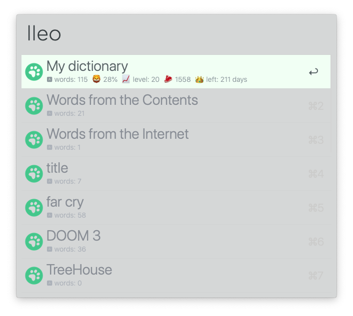
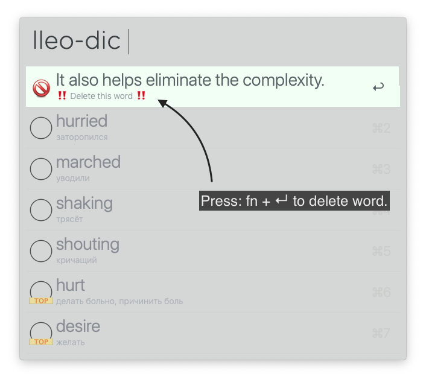
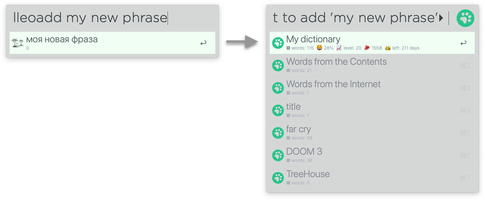
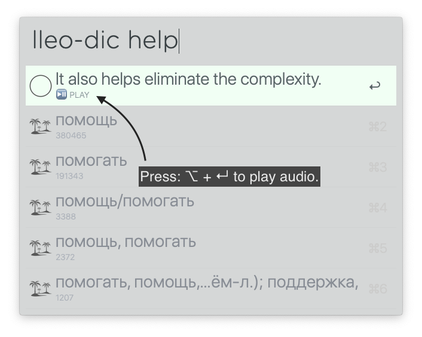
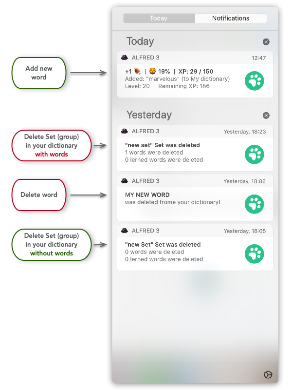

# alfred-lingualeo [](https://travis-ci.org/bikenik/alfred-lingualeo)

## 

## Search in your LinguaLeo's dictionary by headword or phrase or by selected text from anywhere and add new: words / phrase / sentence



## Install

```
$ npm install --global alfred-lingualeo
```

*Requires: [Node.js](https://nodejs.org) 7.6+, Alfred [Powerpack](https://www.alfredapp.com/powerpack/)., account [LinguaLeo](https://lingualeo.com)*

## Preview / Usage

<details>
 

<!-- toc -->

### Create, choose and delete your words in LinguaLeo




### Use <kbd>⌥ + ↵</kbd> to play soud of current word



### Notifications



<!-- tocstop -->

</details>

- In Alfred, type `lleo`, <kbd>Enter</kbd>, and your query.

## Configuration

- username: your email (account linguaLeo)
- password: your password (account linguaLeo)
- your_language: ru, es

### Postman collection of LinguaLeo's API:

- [Postman Collection](https://github.com/bikenik/alfred-lingualeo/blob/master/Lingua-Leo.postman_collection.json)

### ToDo

- [ ] Tests
- [ ] Improve on speed for display of dictionary

## License

MIT © [bikenik](http://bikenik.org)
